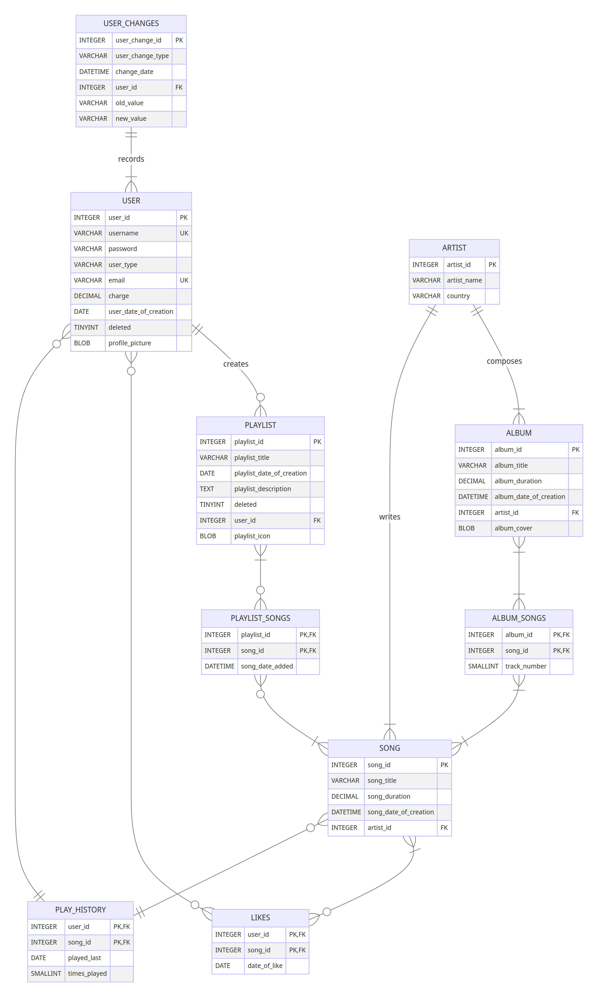

# Design Document

By Kostantinos Antonopoulos

Video overview: <https://youtu.be/StMSmv9Ta_k>

## Scope

Project title: 'Spotify' - like Database  

The purpose of this database, aptly named "spotify", is to create the backbone of a database based on and with similar function
to the popular app 'Spotify'. This "spotify" database is very bare bones and it can only perform very basic and simplistic functions.
Included on the DBs scope are:

* Users, including basic identifying information.
* Artists.
* Albums, each artist has created one or more albums, each album is including basic identifying information.
* Songs, each albums or playlist is consisted of songs. Every user can like multiple songs, each song is including basic identifying information.
* Playlists, each playlist is created by a user and contains none or multiple songs, each playlist including basic identifying information.
* Play_history, where the songs every user has listened to are presented from most recent replay to oldest, cumulative replays are talied.
* Records of all new users, returning users and updates of user information.
  NOTE: Similar functions for albums,songs,artists etc could be implemented but they are no for simplicity's sake.

Out of scope for this DB are:

* Podcasts
* Artists that comprise of multiple members represented as such.
* Liking playlists
* Liking albums
* Records of updates,insertions,deletions on entities other than users.
* SEE LIMITATIONS

## Functional Requirements

* A user should be able to create and delete a user accout.
    NOTE: The deletion of an account does not truly delete the user,
    it just makes everything invisible (except the likes the user has made which are completely deleted)
* A user should be able to like and unlike songs.
* A user should be able to create playlists and put and remove songs from them.
* A user should be able to play or replay any song he wants.
* A user can perform changes upon playlists.
* Artists their albums and theirs songs could be inserted into the DB.
* A lot of varieties of views (SEE schema.sql, quries.sql)

* A user cannot completely delete his account.
* A user cannot have private playlists.
* A user cannot have a shared account.
* A user cannot like/dislike any playlists, albums directly (the process to implement this would be simple and quite similar to the one
    already used for liking songs. It is not implemented on purpose to keep this project a bit simpler.)

## Representation

MySQL has been used for this DB (SEE schema.sql)

### Entities

VARCHAR is used so there is input flexibility.

All justifications for PRIMARY KEYS that are ids, are:
     INT is chosen to support a practically unlimited amount of x.
     NOT NULL is unnecessary as id is the primary key, it exists purely out of better representation of the logic behind the table.
     AUTO_INCREMENT so every new INSERT has a different sequentialy bigger id.

ALL justifications for DATETIMES are:
    DATETIME is used so there is an exact snapshot of when a playlist was created.
    DEFAULT CURRENT_TIMESTAMP records the time when the x was created.

#### user

* The user entity:
    * PK user_id INT NOT NULL AUTO_INCREMENT:
    * username VARCHAR NOT NULL UNIQUE:
        NOT NULL because a user cannot not have a username.
        UNIQUE because 2 users cannot have the same username.
    * password VARCHAR NOT NULL:
         NOT NULL because a user cannot not have a username.
    * user_type ENUM('student', 'individual', 'family'):
        The user can be 1 of 3 types. Depending on what he is, his charge is calculated accordingly.
    * email VARCHAR NOT NULL UNIQUE:
        NOT NULL because a user cannot not have an email.
        UNIQUE because a user cannot have multiple user_accounts with the same email.
    * charge DECIMAL(5, 2)  DEFAULT 7.99:
        DECIMAL so as the charge of every user is calculated in euros/dollars (7.99 is 7 euros and 99  cents).
        DEFAULT 7.99 the charge corresponding to the 'individual' user_type which is supposedly the most common.
    * user_date_of_creation DATETIME DEFAULT CURRENT_TIMESTAMP:
    * profile_picture BLOB:
        The profile picture that every user is going to have on his profile.
        BLOB usage is self-explanatory
    * deleted TINYINT DEFAULT 0:
        TINYINT because deleted is meant to be a boolean variable (0 or 1).
        DEFAULT 0 means the playlist exists, when deleted = 1 the user is soft deleted.

#### playlist

* The playlist entity:
    * playlist_id INT NOT NULL AUTO_INCREMENT:
    * playlist_title VARCHAR NOT NULL:
        Title of the playlist, must exist (could probably allow a playlist without a title)
    * playlist_description TEXT:
        Text chosen so as the description can be as big as someone likes.
    * playlist_icon BLOB:
        The picture/icon of the playlist.
        BLOD usage is self-explanatory.
    * FK user_id INTEGER NOT NULL:
        The PK of the user table, connects every playlist to the user that created them.
        A user can create multiple playlists but a playlist can be created by only one user.
    * playlist_date_of_creation DATETIME NOT NULL DEFAULT CURRENT_TIMESTAMP:
    * deleted TINYINT DEFAULT 0:
        TINYINT because deleted is meant to be a boolean variable (0 or 1).
        DEFAULT 0 means the playlist exists, when deleted = 1 the user is soft deleted.
        IF a user is soft deleted, all his playlists are soft deleted too through a procedure (SEE SCHEMA.SQL)

#### artist

* The artist entity:
    * PK artist_id INT NOT NULL AUTO_INCREMENT:
    * artist_name VARCHAR(50) NOT NULL:
        Every artist needs to have a name/band name.
        The name is not UNIQUE as 2 different artists might have unknowingly the same name.
    * country VARCHAR:
        Optionaly the country where the artist hails from.

#### song

* The song entity:
    * PK song_id INT NOT NULL AUTO_INCREMENT:
    * song_title VARCHAR NOT NULL:
        Every song must have a titple
    * song_duration DECIMAL (5, 2) NOT NULL:
        The duration of a song in seconds. Not calculated beyond 2 decimals due to the non need of being perscise.
    * song_date_of_creation DATE NOT NULL:
        The date an album is created may be different than the date a song that was featured within it was created. Thus both dates are
        inserted manually and there is no procedure or trigger to make them equal.
    * FK artist_id INTEGER NOT NULL:
        Every song is composed by an artist and liked to them through this FOREIGN KEY.

#### playlist_songs

* The playlist_songs bridge entity:
    * PK,FK playlist_id INT NOT NULL:
    * PK,FK song_id INT NOT NULL:
        A playlist may include multiple songs and a song can be featured in many playlist  through the use of these FOREIGN KEYS.
    * song_date_added DATETIME DEFAULT CURRENT_TIMESTAMP:

#### likes

* The likes bridge entity:
    * PK,FK user_id INT NOT NULL:
    * PK,FK song_id INT NOT NULL:
        A composite PRIMARY KEY signaling that every user may like one to many songs and a song can be liked by one to many users.
    * date_of_like DATETIME NOT NULL DEFAULT CURRENT_TIMESTAMP:

#### play_history

* The play_history entity
    * This represents the collective times a user has listened to a particular song.
    * PK,FK user_id INT NOT NULL:
    * PK,FK song_id INT NOT NULL:
        A composite PRIMARY KEY signaling that one or many users can listen to one or many songs.
    * played_last DATETIME NOT NULL DEFAULT CURRENT_TIMESTAMP:
        This gets updated through a procedure (SEE schema.sql) everytime a song is replayed and it always
        shows the latest datetime this has happened.
    * times_played SMALLINT NOT NULL DEFAULT 1:
        SMALLINT due to the time-wise limited times a user can replay a song.
        DEFAULT 1 because if a user and a song pair is in this table, then he has listened to a song at least once.

#### album

* The album entity:
    * PK album_id INTEGER NOT NULL AUTO_INCREMENT:
    * album_title VARCHAR NOT NULL:
        An album must have a title.
    * album_duration DECIMAL(5, 2) NOT NULL:
        The duration of an album in seconds.
        NOTE: Unlike playlists the duration of an album is given as an input during the INSERT.
    * album_date_of_creation DATE NOT NULL:
        The date an album is created may be different than the date a song that was featured within it was created.
    * album_cover BLOB:
        Cover art of an album
        BLOB use is self-explanatory
    * FK artist_id INT:
        An artist composes an album and is connected to it through this FOREIGN KEY.

#### album_songs

* The album_songs bridge entity:
    * PK,FK album_id INT NOT NULL:
    * PK,FK song_id INT NOT NULL:
        An album may include multiple songs and a song can be featured in many albums through the use of these FOREIGN KEYS.
    * track_number SMALLINT:
        SMALLINT is used  due to an album having a very limited number of tracks.

#### user_changes
* The entity user_changes:
    * PK user_change_id INT NOT NULL AUTO_INCREMENT:
    * user_change_type VARCHAR(20) NOT NULL:
        When a change is implemented on the user table, its type is stored here.
        For example when there is a new user inserted in the user table, the user_change_type = New user.
    * change_date DATETIME NOT NULL DEFAULT CURRENT_TIMESTAMP:
    * FK user_id INT NOT NULL:
        All inserts,delets,updates that happen on a certain user are recorded
    * old_value VARCHAR(50) DEFAULT '-':
    * new_value VARCHAR(50) DEFAULT '-':
        If the user table gets update both the old and the new values are stored in the recording table.
        DEFAULT is '-' so for example when there is a new user inserted the old value of his username(that did not exist before the insertion) is -.

### Relationships

The below entity relationship diagram describes the relationships among the entities in the database.

Detailed:

* The user_changes table records the movements of one or more users but all users are recorded by the same table.
* Every user creates one or more playlists, but every playlist is created by only one user (even if it has the same name to some other playlist)
* Every user likes 0 to many songs and every song is liked by none or many users.
* Every users play_history is recorded into the play_history table which is only one
    (provided the user has listened to at least one song to be user in the fist place). The play_history table records the history of one to many user.
* One playlist can contain 0 to many songs and a song can be included in none to many playlists (through the playlist_song bridge entity).
* Every artist composes one to many albums (otherwise they would not be artists) and every album is composed by only one artist
    LIMITATION:normaly there could be collaborations between artists but this is unusual and not implemented in this DB.
* Every album contains at least one song (in case it is the release of a single) or many and every song is included in one to many albums (best ofs, compilations etc).This happens  through the album_songs entity.
* Every artist writes one to many songs(otherwise they would not be considered artist) but every song is written by only one artist
    LIMITATION:like in the albums relationship, we could consider collaborations remixes etc but this is not implemented.

## Optimizations

### Indexes

Due to this DB always requiring a lot of updates,inserts (frequent releases of new albums, songs etc) only a few indexes are created.

*  idx_artist ON artist(artist_name):
    Due to the fact that the number of artists is very minimal compared to the collective number of songs released every year.
* idx_album ON album(artist_id, album_title):
    Every albums has many songs, thus its safer to create an index for the albums (not so frequent inserts, updates).
    That being said this index could probably be skipped.
* idx_username ON user(username):
    ONLY because a small number of traffic would be expected in a DB like this one

### VIEWS

* most_liked_songs:
    Songs ordered depending on the amount of likes each song has from multiple users.
    If a user is soft-deleted, his likes are going to be deleted too.
* most_liked_playlists:
	Playlists ordered depending on the cumulative likes of all songs contained in them.
    NOTE-LIMITATION: Users cannot directly like playlists or albums.
* most_liked_albums:
	Albums ordered depending on the cumulative likes of all songs contained in them.
    NOTE-LIMITATION: Users cannot directly like playlists or albums.
* albums_of_artists:
	Albums and the artists that created them.
* songs_of_albums:
	Songs and the albums they are included in.
* user_playlists:
	Playlists and the users that created them, the duration of the playlist is calculated on the fly.
* songs_of_playlists:
	Songs that are included in the playlists.
* user_likes:
    User usernames and the songs they like.
* users_not_deleted:
    A view that shows non deleted users.
* history:
    A cleaner play_history table.
* most_replayed_songs:
    Most replayed songs based on the history view.
* most_replayed_albums:
    Most replayed albums based on the history view.
* most_replayed_playlists:
    View similar to most_liked_playlists that shows how many cumulative times the songs of a playlist have been replayed.

### PROCEDURES

* SoftDelete (IN in_username VARCHAR(50)):
    The user is soft deleted as well as his playlists,
    but his favorite songs(likes) are permanently deleted and if he ever comes back, he needs to start all over.
* SoftInsert(IN in_username VARCHAR(50),IN in_password VARCHAR(50),IN in_user_type VARCHAR(50), IN in_email VARCHAR(50)):
    The user is restored only if the new user account created has exactly the same username and email.
    If only the username matches then the new user is going to have to find a new one, if only the email matches, the user is going to have to use another one.
    Depending on the user_type, the charge is changed.
* replays (IN in_username VARCHAR(50), IN in_song_title VARCHAR(50)):
    Stored procedure that increases the times_played counter of a song in history VIEW if its already in the play_history table.
    Otherwise it just adds a new song into the play_history if both the user and the song exists.
* EasyLike(IN in_username VARCHAR(50), IN in_song_title VARCHAR(50)):
* EasyDislike(IN in_username VARCHAR(50), IN in_song_title VARCHAR(50)):
  2 easy procedures so that we can insert and remove from the likes table without using the id of users and songs.
* EasyAddPlaylistSong(IN in_playlist_title VARCHAR(50), IN in_song_title VARCHAR(50)):
* EasyRemovePlaylistSong(IN in_playlist_title VARCHAR(50), IN in_song_title VARCHAR(50)):
    2 easy procedures so that we can insert and remove from each playlist without using the id of the playlist and the songs.
    One caviat is that all users can add and remove songs from any playlist.
    Playlists from soft deleted users are not visible.

### TRIGGERS

* user_inserted AFTER INSERT ON user:
    Inserts into the user_changes table after a fresh insert
* user_updated:
    Inserts into the user_changes table after an update

## Limitations

* A user or more users can have multiple playlists with the same name, in which case the insertion deletion regarding
    thos playlists is faulty.
* A playlist can have an almost endless number of songs. Normally there should have been a limit.
* For starters all bands, albums, songs, users, playlists etc need to be inserted one by one manually.
* This means the DB cannot support a large number of traffic.
* A playlist cannot being private (accessible only by the user who created them).
* Family members sharing a single user account and an admin user account are missing,
     (However the monthly cost of an account changes if the user is 'family' type).
* This final project also assumes that the only content on the DB will be music (songs) and not podcasts, e-books etc.
* The users don't have any link to the real world (no country, address, city, phone needed for this DB), except their email.
* The artists are treated as a single entity (whether the artist is a band with several members or a single singer).
* Only the user inserts,updates,deletes are recorded.
* A few relationships are not represented perfectly (SEE RELATIONSHIPS)
